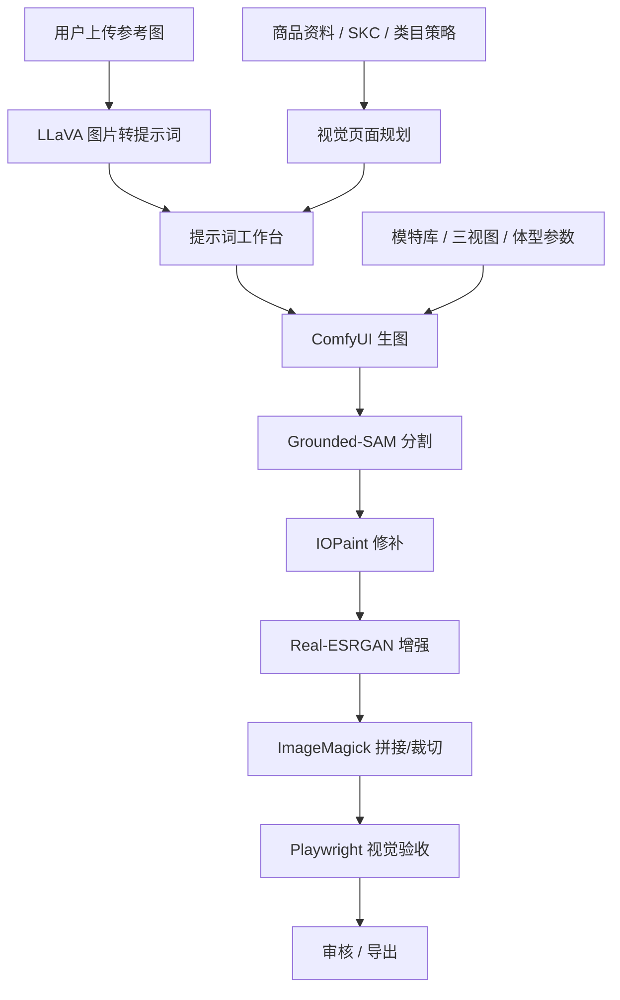

# 视觉详情页生成需求补充

版本：v0.1  
日期：2026-05-24  
范围：补齐商品详情页 AI 工作台的视觉资产生成、模特库、SKC、多工具调用和出图交付需求。

## 1. 目标

系统不仅生成详情页文案，还要能生成可直接使用的电商视觉资产：

- 5 张 `1:1` 主图
- 5 张 `3:4` 主图
- 一套按屏生成、可拼接成长图的详情页视觉内容
- 每张图都保留 prompt、参考图、模型、工具、版本、来源和人工审核状态

第一版不追求全自动发布，目标是“出图可审、出图可用、链路可追踪”。

## 2. 类目视觉策略

### 2.1 类目分层

| 类目类型 | 模特要求 | 典型类目 | 视觉策略 |
|---|---|---|---|
| 精致统一模特类 | 必须使用统一模特库 | 女装、内衣、鞋靴、配饰穿搭 | 模特三视图、身高体重三围、姿态、风格必须统一 |
| 伴生模特类 | 可选模特，不要求强统一 | 隐形眼镜、美妆局部、饰品局部 | 模特只作为使用场景或局部展示，不作为核心识别资产 |
| 无模特类 | 不需要模特 | 狗粮、食品、日用品、包装商品 | 以产品、场景、卖点、规格、包装、使用效果为主 |

### 2.2 类目策略字段

| 字段 | 类型 | 说明 |
|---|---|---|
| `categoryCode` | String | 类目编号 |
| `categoryName` | String | 类目名称 |
| `modelPolicy` | Enum | `REQUIRED` / `OPTIONAL` / `FORBIDDEN` |
| `modelConsistencyLevel` | Enum | `STRICT` / `LOOSE` / `NONE` |
| `allowedShotTypes` | List | 模特图、平铺图、实物图、场景图、细节图 |
| `requiredMainImages` | Object | 默认 5 张 1:1、5 张 3:4 |
| `detailScreenCountRange` | Object | 详情页分屏数量范围 |
| `riskRules` | List | 类目合规限制 |

## 3. 用户自建模特库

女装等强模特类目必须使用用户自建模特库，不能每次随机生成不同人物。

### 3.1 模特资料字段

| 字段 | 类型 | 说明 |
|---|---|---|
| `id` | Long | 模特 ID |
| `displayName` | String | 内部名称 |
| `frontImage` | String | 正面图 |
| `sideImage` | String | 侧面图 |
| `backImage` | String | 背面图 |
| `height` | BigDecimal | 身高 |
| `weight` | BigDecimal | 体重 |
| `bust` | BigDecimal | 胸围 |
| `waist` | BigDecimal | 腰围 |
| `hip` | BigDecimal | 臀围 |
| `styleTags` | List | 风格标签 |
| `categoryScopes` | List | 可用类目 |
| `authorizationStatus` | Enum | 授权状态 |
| `version` | Integer | 版本 |
| `status` | Enum | 启用/停用 |

### 3.2 模特复用规则

1. 同一详情页内必须使用同一个 `modelProfileId`。
2. 同一品牌可配置默认模特库。
3. 模特图必须保留来源、授权状态、版本号。
4. 模特一致性失败时，生图结果标记为 `NEEDS_REGENERATE`，不能进入可导出状态。

## 4. SKC 视觉策略

### 4.1 SKC 输入

| 字段 | 类型 | 说明 |
|---|---|---|
| `colorCount` | Integer | 颜色数量 |
| `specCount` | Integer | 规格数量 |
| `colors` | List | 颜色名称、色值、参考图 |
| `specs` | List | 尺码/容量/款式 |
| `renderMode` | Enum | `MODEL` / `FLAT_LAY` / `REAL_PRODUCT` / `MIXED` |
| `variantDisplayMode` | Enum | 平铺、宫格、单色单图、多色合集 |

### 4.2 出图规则

1. 用户可以选择每个颜色/规格是否生成独立图。
2. 用户可以选择平铺图或实物图。
3. 女装默认至少包含：模特主图、背面/侧面、细节、颜色平铺、尺码/卖点图。
4. 无模特类默认包含：包装正面、产品细节、使用场景、规格平铺、卖点说明图。

## 5. 提示词工作台

提示词能力必须包含两条路径。

### 5.1 引导用户生成提示词 + 提示词扩写

输入：

- 商品资料
- 类目策略
- 品牌调性
- 平台要求
- 画幅
- SKC 规则
- 模特库选择
- 市场视觉参考

输出：

- `positivePrompt`
- `negativePrompt`
- `shotScript`
- `composition`
- `lighting`
- `camera`
- `styleTags`
- `riskWarnings`

### 5.2 图片转提示词

输入：

- 用户上传图片
- 分析目标：风格、构图、材质、姿态、商品卖点
- 类目约束

输出：

- 图片描述
- 可复用 prompt
- 不允许复刻的元素提醒
- 可迁移的构图和风格标签

推荐工具：`llava / image-to-prompt`。

## 6. 视觉页面规划

AI 不能直接盲目出图，必须先生成视觉逻辑链路。

### 6.1 规划步骤

1. 读取商品资料、品牌约束、类目策略、SKC。
2. 读取市场参考资料和人工导入的视觉方向。
3. 输出主图策略：5 张 1:1、5 张 3:4。
4. 输出详情页分屏策略：每一屏表达一个卖点或证据。
5. 为每张图生成 prompt、参考图、工具链、验收标准。
6. 人工确认后再进入批量生图。

### 6.2 主图建议结构

| 序号 | 1:1 主图 | 3:4 主图 |
|---|---|---|
| 1 | 核心商品/模特正面 | 核心商品/模特全身 |
| 2 | 侧面/背面/结构 | 穿着或使用场景 |
| 3 | 材质/细节 | 卖点细节 |
| 4 | SKC 平铺/颜色 | 多色/多规格展示 |
| 5 | 场景/利益点 | 平台风格强化图 |

### 6.3 详情分屏建议结构

| 屏 | 目的 |
|---|---|
| 1 | 首屏定位和核心利益点 |
| 2 | 商品/模特整体展示 |
| 3 | 核心卖点 1 |
| 4 | 核心卖点 2 |
| 5 | 材质、工艺或成分 |
| 6 | SKC、规格、颜色 |
| 7 | 使用场景 |
| 8 | FAQ、注意事项、售后承诺 |

## 7. 工具链编排

## 8. 后端模块拆分

| 模块 | 责任 |
|---|---|
| `CategoryVisualPolicy` | 管理类目视觉策略和模特使用规则 |
| `ModelProfile` | 用户自建模特库 |
| `SKCPolicy` | 颜色、规格、图型策略 |
| `PromptWorkbench` | 提示词引导、扩写、图转提示词 |
| `VisualPagePlanner` | 主图和详情页分屏规划 |
| `ImageJob` | 生图任务、状态、失败重试 |
| `DetailComposer` | 切片拼接、尺寸归一、导出 |
| `ToolAdapter` | 调用第三方自部署工具 |
| `ModelRegistry` | 管理文本模型、生图模型、视觉模型的可配置入口 |

## 9. 推荐接口

| 功能 | 方法 | 路径 |
|---|---|---|
| 类目策略列表 | GET | `/api/v1/category-visual-policies` |
| 保存类目策略 | POST | `/api/v1/category-visual-policies` |
| 模特库列表 | GET | `/api/v1/model-profiles` |
| 新增模特 | POST | `/api/v1/model-profiles` |
| 生成引导 prompt | POST | `/api/v1/prompt-workbench/guided` |
| 扩写 prompt | POST | `/api/v1/prompt-workbench/expand` |
| 图片转 prompt | POST | `/api/v1/prompt-workbench/image-to-prompt` |
| 创建视觉规划 | POST | `/api/v1/visual-plans` |
| 确认视觉规划 | POST | `/api/v1/visual-plans/{id}/confirm` |
| 创建生图任务 | POST | `/api/v1/image-jobs` |
| 查询生图任务 | GET | `/api/v1/image-jobs/{id}` |
| 重试生图任务 | POST | `/api/v1/image-jobs/{id}/retry` |
| 拼接详情长图 | POST | `/api/v1/detail-compositions` |

## 10. 验收标准

1. 女装类目选择模特后，同一详情页所有模特图保持同一模特身份和体型参数。
2. 隐形眼镜类目允许无统一模特，仅在需要时使用眼部/局部场景图。
3. 狗粮等无模特类目不要求模特参与。
4. 每个 SKC 可选择是否生成平铺图、实物图或模特图。
5. 生成前必须有视觉规划，生成后必须有工具链记录。
6. 每张图必须可追踪 prompt、模型、工具、输入素材、输出文件、审核状态。
7. 工具未配置或调用失败时，系统明确失败，不返回假图片或假 prompt。

